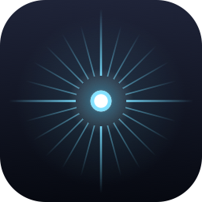
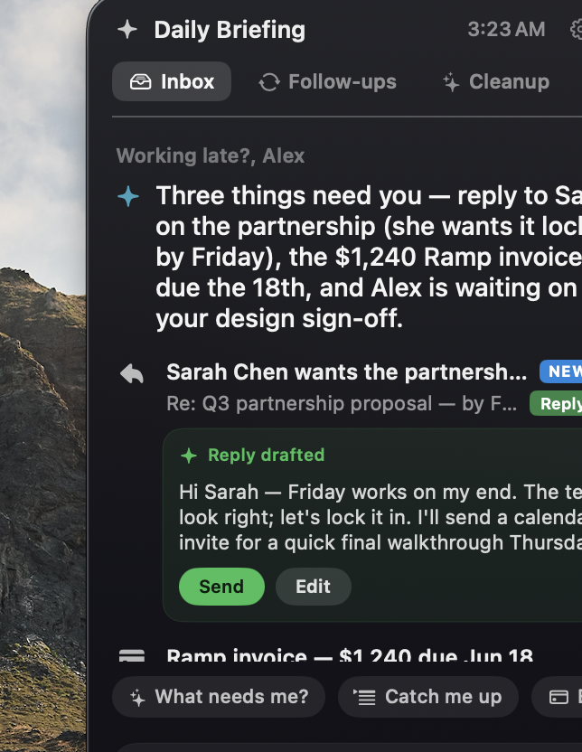
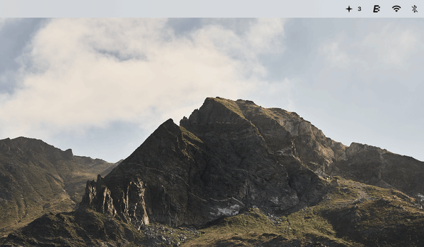
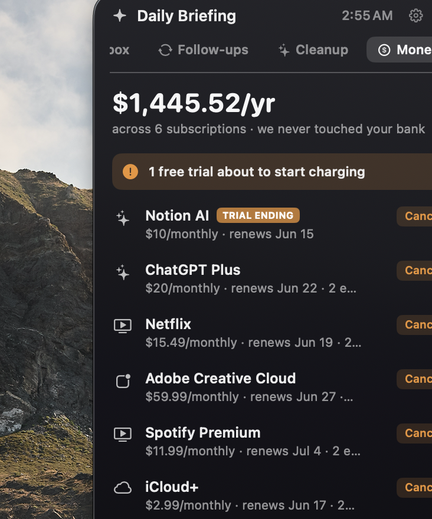
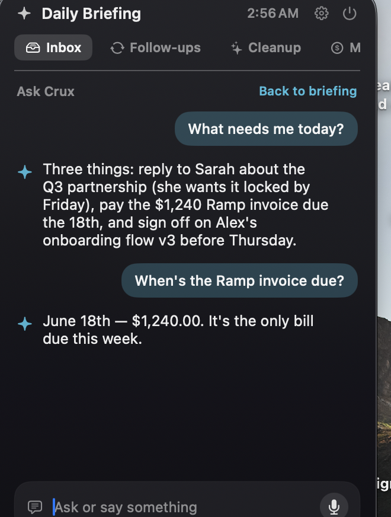

<div align="center">



# Novex

### Your inbox, distilled to what actually matters - privately, on your Mac.

Novex is a free, open-source menu-bar assistant that reads your mail **100% on-device**, tells you the few things that genuinely need you, drafts your replies, and quiets the rest. No account. No cloud. No telemetry. Your email never leaves your Mac.

[](https://github.com/Tharuntejandhe/Novex/actions/workflows/swift.yml)
[](LICENSE)




</div>

---

## Why Novex

Your inbox is 95% noise - newsletters, job alerts, receipts, "someone mentioned you" - and 5% that actually needs you. Every other email tool fixes this by **uploading your mail to their servers** and running it through their AI.

Novex does the opposite. It runs Apple's on-device foundation model **right on your Mac**. The same intelligence, but your mail is never sent anywhere, never stored on a server, never used to train anything. It's the privacy you'd want from something reading your email.

> **The rule:** correctness lives in code (deterministic ranking, no LLM guessing what's important); the model only *phrases* the result. So Novex is fast, predictable, and never "hallucinates" your inbox.

---

## Works with your accounts

Novex needs **no passwords and no API keys**. It reads whatever you've already added to **Apple Mail**, so it works with every major provider:

> **Gmail (Google), iCloud, Outlook / Microsoft 365, Yahoo, and any IMAP account.**

The trick: your provider syncs into Apple Mail, and Novex reads that **local, on-device copy**. It never logs into Google or Microsoft, and your password stays with Apple.

It also reads, on-device:

- **Apple Calendar** (including a **Google Calendar** synced into it) to show what's next and link meetings to the related mail.
- **Apple Reminders** (including **Google Tasks** synced in) to show what's on your plate.

Adding a new account is just adding it to Apple Mail. Everything stays on your Mac.

---

## What it does

| | Feature | What you get |
|---|---|---|
| 📩 | **Daily briefing** | The handful of emails that genuinely need you - surfaced from the noise by a deterministic importance engine (Apple's own urgent/high-impact ML verdicts + unread/flagged - newsletter/bot penalties). |
| ✍️ | **Smart Reply** | Novex pre-drafts a reply for the top message that needs one, in *your* voice. You just Send or Edit. Never drafts to no-reply/bot senders. |
| 🔁 | **Follow-up Radar** | Threads where *you're* waiting on a reply, so nothing slips. |
| 📚 | **Catch me up** | A grouped digest of everything recent (jobs, social, newsletters) - readable instead of a flat list. |
| 🧹 | **Declutter & Unsubscribe** | Finds the senders flooding your inbox and one-taps the real `List-Unsubscribe`. |
| 💸 | **Money Radar** | Detects subscriptions & free-trials-about-to-charge from renewal emails - **no bank login, ever**. Free and complete. |
| ✨ | **Discover ("Worth a look")** | Pulls the genuinely interesting items out of the newsletters *you already get*, matched to your field - so you don't miss the good stuff. |
| 🎙️ | **Ask Novex** | A chat box (type or speak) to ask anything about your inbox - answered on-device, in plain language. |
| 🛎️ | **Live notification card** | A clean Dynamic-Island-style card drops in for important new mail, then a dot glides up to the menu bar. (Toggle the animation off if you prefer.) |
| 🧠 | **Learns you** | Builds a private, on-device model of what you care about from what you open and star - and from the interests you set. |
| 📅 | **Calendar + Reminders aware** | Shows what's next and what's on your plate, alongside your mail. |

### See it

<div align="center">

**The fly-to-Novex handoff** - when important mail arrives, a card drops under the notch and a dot glides up to the menu bar:



</div>

| Money Radar | Ask Novex |
|:-:|:-:|
|  |  |
| Every subscription + trials about to charge - **no bank login** | Chat with your inbox by **text or voice**, answered on-device |

---

## 🔒 Privacy - the whole point

- **On-device AI.** Summaries, drafts, and answers run on Apple's Foundation Models, locally. Your mail is never uploaded.
- **Zero accounts, zero telemetry.** Novex has no backend. It can't see your data because there's nowhere for it to go.
- **The *only* network connection** Novex can make is an **optional, once-a-day, anonymous** check to GitHub to see if a new version exists - it sends nothing about you, and you can turn it off in Settings.
- **Open source (MIT).** Read every line. Build it yourself.

---

## Requirements

- **Apple Silicon Mac (M1 or newer)** - required for the on-device AI.
- **macOS 26 (Tahoe) or later.**
- **Apple Intelligence enabled** (System Settings → Apple Intelligence & Siri).
- Your mail added to **Apple Mail** (see [Setup](#setup) - this is how Novex reads Gmail/iCloud/Outlook without ever logging in).

> Novex still shows your inbox, Money Radar, and Discover on machines without Apple Intelligence - it just skips the AI phrasing.

---

## Install

### Option A - Download (easiest)

1. Download **`Novex.zip`** from the [latest release](https://github.com/Tharuntejandhe/Novex/releases/latest).
2. Unzip and move **Novex.app** to `/Applications`.
3. **First launch only:** right-click `Novex.app` → **Open** → **Open**.
   *(Novex is open-source and not notarized - we don't pay for an Apple Developer ID - so macOS asks once. You can verify exactly why in the source.)*
   <br>Alternatively: `xattr -dr com.apple.quarantine /Applications/Novex.app`

### Option B - Homebrew

```bash
brew install --cask Tharuntejandhe/novex/novex
```

### Option C - Build from source (no Gatekeeper prompt at all)

```bash
git clone https://github.com/Tharuntejandhe/Novex.git
cd Novex
Scripts/make-app.sh           # builds Novex.app into ~/Applications
Scripts/install-login-item.sh # (optional) start at login
```

Requires the Swift toolchain (Xcode or the Command Line Tools). Because *you* built it locally, macOS trusts it immediately.

---

## Setup

> Two one-time grants, then Novex just works.

### 1. Add your email to Apple Mail

**Novex never logs into Google/Microsoft.** It reads the *local copy* of mail that **Apple Mail** keeps on your Mac. So:

- System Settings → **Mail / Internet Accounts** → **Add Account** → Google (or iCloud / Outlook / IMAP).
- Let Mail finish its first sync.

That's the magic: your provider syncs to Apple Mail, and Novex reads that on-device store. Your password stays with Apple; Novex only sees the local files.

### 2. Grant Full Disk Access

Novex reads Mail's local database, which macOS protects:

- System Settings → **Privacy & Security** → **Full Disk Access** → toggle **Novex** on (add it with **+** → `~/Applications/Novex.app` if it's not listed).

### 3. First-run onboarding

Tell Novex your name and your field/interests (e.g. *"robotics, startups"*) so Discover and ranking work from day one. Done - click the ✦ in your menu bar anytime.

---

## Using Novex day-to-day

Novex lives in your menu bar (the **✦**). The number next to it is the live count of things that actually need you.

- **Glance at the briefing.** Click ✦ - the top speaks like an assistant (*"Three things need you - reply to Sarah…"*), then lists what matters. When nothing does, it says so (no fake busywork).
- **Reply in two taps.** For mail that needs a reply, Novex has **already drafted one** in your voice - hit **Send**, or **Edit** to re-tone it (Shorter / Warmer / Formal). It never drafts to bots/no-reply senders.
- **Catch up after time away.** Tap **Catch me up** for a grouped digest - or just open your laptop: Novex greets you with what you missed (and stays silent if nothing did).
- **Ask anything.** Type or 🎙️ **speak** in the ask bar: *"what needs me?"*, *"when's the invoice due?"*, *"did the bank email?"* - answered on-device.
- **Kill the noise.** **Cleanup** one-taps real unsubscribes; **Money** flags subscriptions and free-trials about to charge, with a Cancel link.
- **Worth a look.** Novex surfaces the genuinely interesting reads buried in your newsletters, matched to your interests.
- **Notifications, your way.** Important new mail drops a card under the notch **within seconds** (panel open or not) and a dot flies to ✦. Prefer it calm? **Settings → Notification animation → Off.**

### Settings worth knowing

| Setting | What it does |
|---|---|
| **Your name & interests** | Personalizes the greeting and powers "Worth a look." |
| **Notification animation** | Turn the flying-dot handoff on/off. |
| **Check for updates** | The *only* network touch - anonymous, once a day. On/off. |
| **Make Novex's voice human** | Appears if your Mac has no natural voice - one tap to download a free Premium one. |
| **VIP senders** | Always top of the briefing, always notify. |
| **Morning digest** | One "here's what needs you" notification a day. |
| **Send feedback** | Opens your mail client, prefilled. |

---

## How it works

```
Apple Mail (local SQLite Envelope Index + .emlx bodies)
        │  read-only, on-device
        ▼
  Deterministic ranking engine  ──►  what actually matters (code, not AI)
        │
        ▼
  Apple Foundation Models (on-device)  ──►  phrasing only: summaries, drafts, answers
        │
        ▼
  Menu-bar panel  |  notification card  |  voice Q&A
```

No servers. No network round-trips for any of your data. Prompts sent to the local model are sanitized against injection (a malicious newsletter can't hijack it) - and that's covered by tests.

---

## FAQ

**Does Novex send my email anywhere?**
No. There is no backend. The only possible network call is the optional update check (anonymous, toggleable).

**Is the unsigned download safe?**
It's open-source - you can read and build it yourself. We skip notarization only because it requires a paid Apple Developer ID. The one-time right-click-Open is macOS being cautious about *any* non-notarized app, not a sign of malware.

**Why Full Disk Access?**
Apple sandboxes Mail's local store. FDA is the only way to read it on-device. Novex is read-only and never copies your mail off the machine.

**Does it work with Gmail / Outlook / iCloud?**
Yes - anything you add to Apple Mail. Novex reads the local copy, so the provider doesn't matter.

**Why is it always dark?**
It's a menu-bar HUD (like Spotlight / the Dynamic Island), which reads best dark regardless of system theme.

**Does it run on Intel Macs?**
macOS 26 may install, but the on-device AI needs Apple Silicon - so the AI features won't be available.

---

## Roadmap

- More on-device connectors (e.g. surfacing Slack/Discord from the local Notification Center store)
- Per-feature scheduling for the daily digest
- Optional Liquid Glass theming on macOS 26

Have an idea? Open an issue.

---

## Contributing

PRs welcome. Run the dependency-free test suite (no Xcode required):

```bash
swift run NovexDevTests
```

## Feedback

Settings → **Send feedback** (opens your mail client), or open a [GitHub issue](https://github.com/Tharuntejandhe/Novex/issues).

## License

[MIT](LICENSE) - free for any use. Your mail is yours; so is this code.

---

<div align="center">

Built by **Tharun Tej** × **Claude**

</div>
